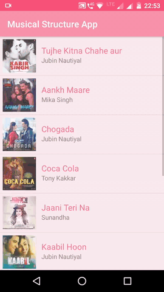

# Musical-Structure-App
Android Basics by Google Nanodegree Program - Udacity

## Project Overview
This project is the first project in "Multi Screens Apps" lesson of the Nanodegree program. This is the structure of a music app using Intents, New Activities, Arraylists, Loops and Custom Classes. The app design and layout depicts the flow for the structure of a Music Player app. Note that for this project, the app does not actually play music.

This project is about combining various ideas and skills practised throughout the course. They include:
- Designing an app experience to achieve a certain goal
- Creating new activities
- Using explicit Intents to link between activities in your app
- Using OnClickListeners to add behavior to buttons using Java code.
- Creating own Custom Class
- Looping through an ArrayList
- Populating a ListView with an ArrayAdapter

## Demo

